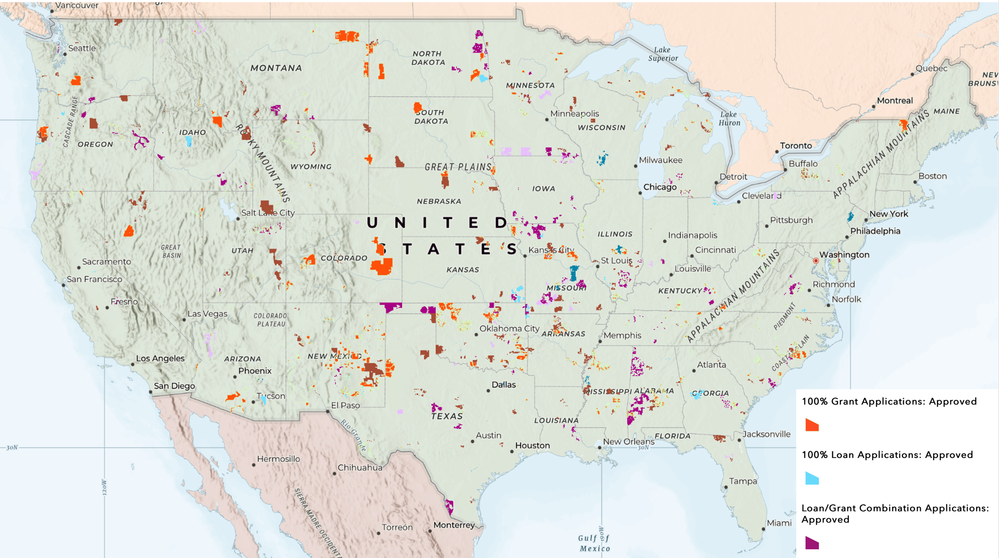

# USDA ReConnect

[The Rural Development Broadband ReConnect Program](https://www.usda.gov/reconnect) furnishes loans and grants to provide funds for the costs of construction, improvement, or acquisition of facilities and equipment needed to provide broadband service in eligible rural areas. To qualify to the ReConnect program funds, the propsed funded service area (PFSA) must meet three conditions:

1. At least 50% of households in PFSA must lack sufficient access to broadband service, which is defined as at least 100 Mbps downstreamand 20 Mbps upstream in the Funding Opportunity Announcement (FOA) published on August 4, 2022.
2. The proposed network must be capable of providing broadband service to every premises located in the PFSA at the speed defined by FOA.
3. The PFSA must be in a rural area. The area must not in located in a city, town, or incorporated area with a population greater than 20,000 inhabitants or an urbanized area contiguous and adjacent to a city that has more than 50,000 inhabitants.

The evaluation of applications also prioritizes the economic needs and social vulnerability of the communities. The exact criteria can be viewed on [USDA website](https://www.usda.gov/reconnect/evaluation-criteria).

To date (August 1, 2023), USDA has funded three rounds of ReConnect program, with the fourth round on-going. From FY2019 to 2023, a total of 316 projects are approved and $3.86 billion are invested across the nation to provide affordable broadband connections for rural communities.

# Project Goals

Broadband investment is a high priority for the Administration and Congress, and over 3 billion dollars have been invested in the ReConnect program. Yet, little research has investigated the program's effect on broadband adoption and rural prosperity. We would like to harness the power of data science to provide insights on this effect. 

Our data sources include the BlackKnight property data, the ReConnect subscription data, the Ookla speed test data, and the broadband deployment data from the Federal Conmission of Communication (FCC). During the DSPG program, we cleaned the datasets, linked them by street address, and performed a difference-in-difference (DID) analysis to isolate the effect of ReConnect.

With the example of one ReConnect project in Iowa, we created a workflow to examine its effectiveness that can be easily reproduced for other ReConnect projects across the country.

